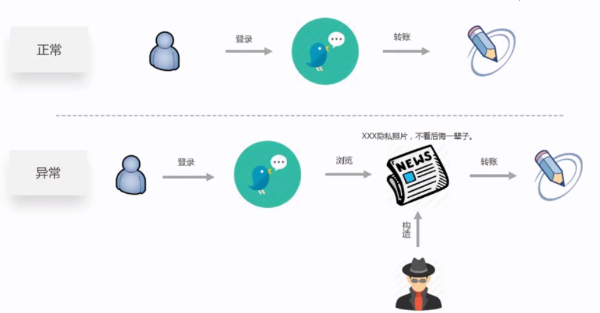
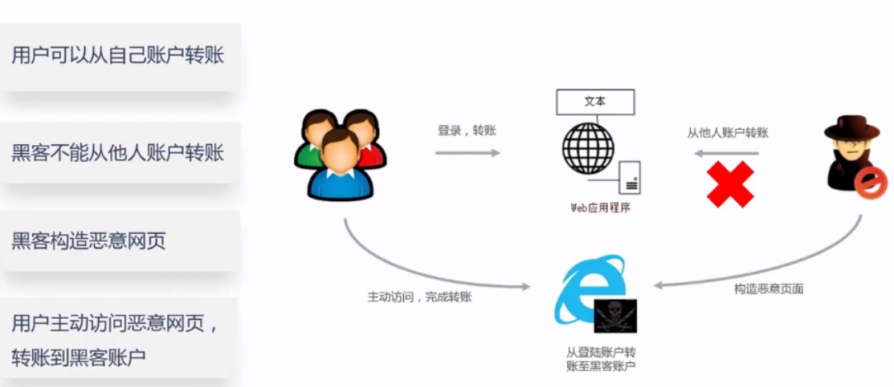
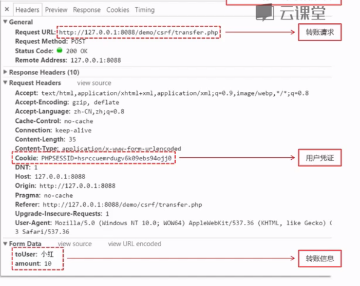
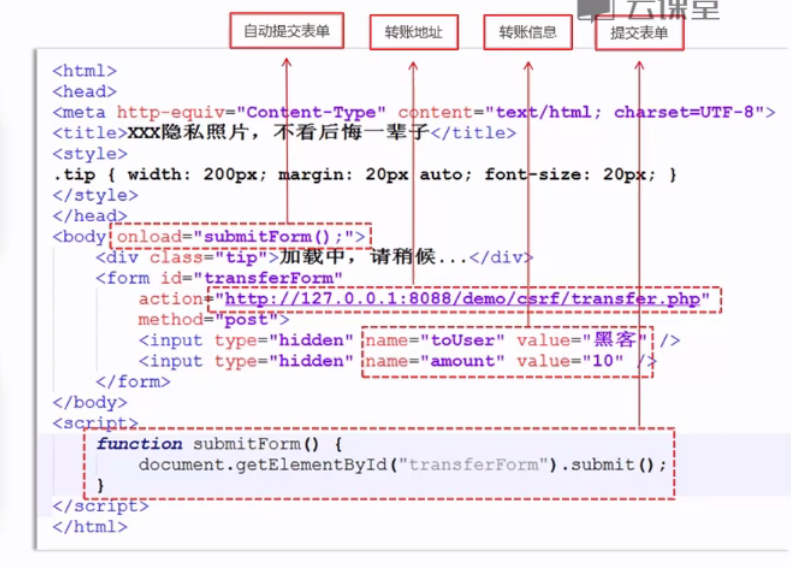

# CSRF

## Criss-site request forgery

####中文名称：跨站请求伪造

####危害：执行恶意操作（“被转账”、“被发垃圾评论”等）

####制造蠕虫

### 概念：

#### 利用用户已登录的身份，在用户毫不知情的情况下，以用户的名义完成非法操作

####通常Cookie当中会存放用户凭证信息

####浏览器在发送任何请求时，会带上自己已有的cookie

####通过Cookie识别用户的身份后，执行转账操作

####构造攻击代码

####打开页面自动完成转账

## 课程回顾

### CSEF漏洞是什么

### CSRF漏洞的危害

### CSRF漏洞的原理

