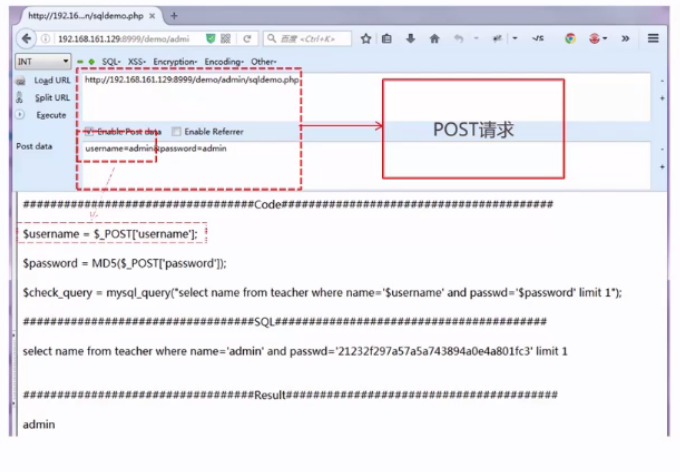
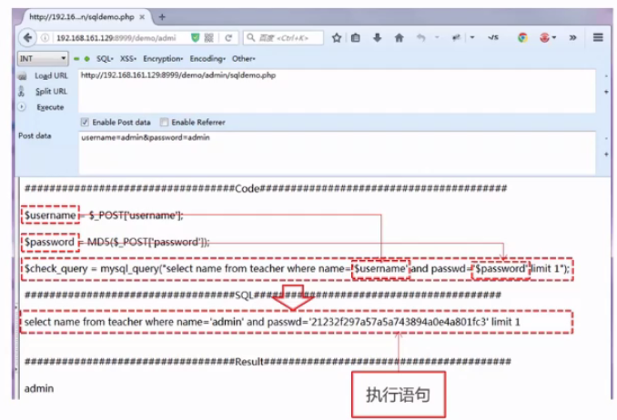
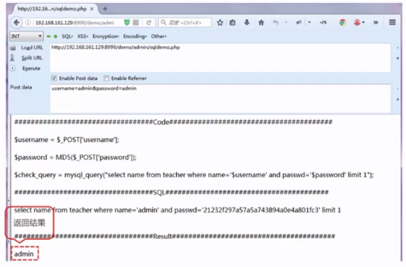
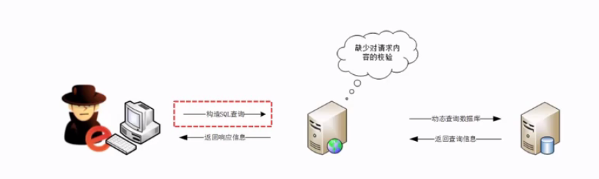
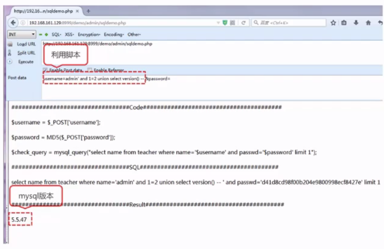
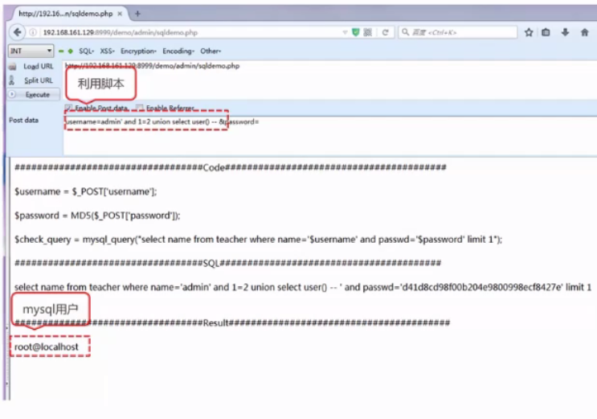

#SQL注入

## SQL Injection 

###是一种常见的Web安全漏洞，攻击者利用这个漏洞，可以访问或修改数据，或者利用潜在的数据库漏洞进行攻击

## 目录

### 万能密码

### SQL注入原理

### 利用和危害

## 万能密码

###Demo分析——正常登录

#### POST请求进行登录

#### 获取请求参数

#### 参数带入代码

#### 根据返回结果

#### 判断是否登陆成功

### Demo分析——万能密码

####利用代码：‘- -

####闭合，注释

### SQL注入的必备条件

####1.可以控制输入的**数据**

####2.服务器要执行的代码拼接了控制的**数据**

## SQL注入原理

### SQL注入的本质

#### ==数据==和==代码==未分离

####及**数据**当作**代码**来执行

### Demo分析——利用

#### 获取系统版本

#### 获取当前数据库用户

## 危害

### 获取数据库信息

#### 管理员后台用户名和密码

#### 获取其他数据库敏感信息：用户名、密码、手机号码、身份证、银行卡信息

#### 整个数据库：脱库

####获取服务器权限

####植入Webshell，获取服务器后门

####读取服务器敏感信息

####万能密码