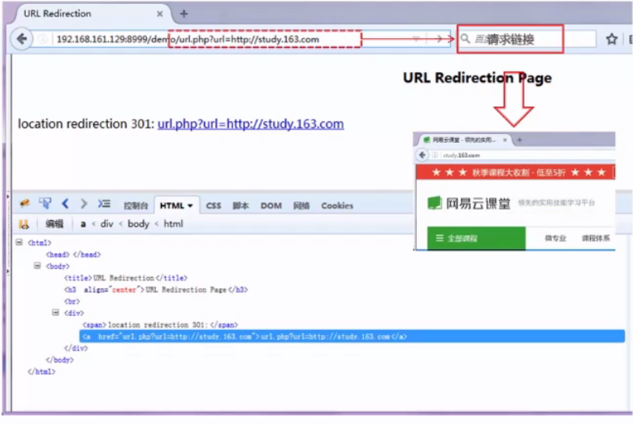
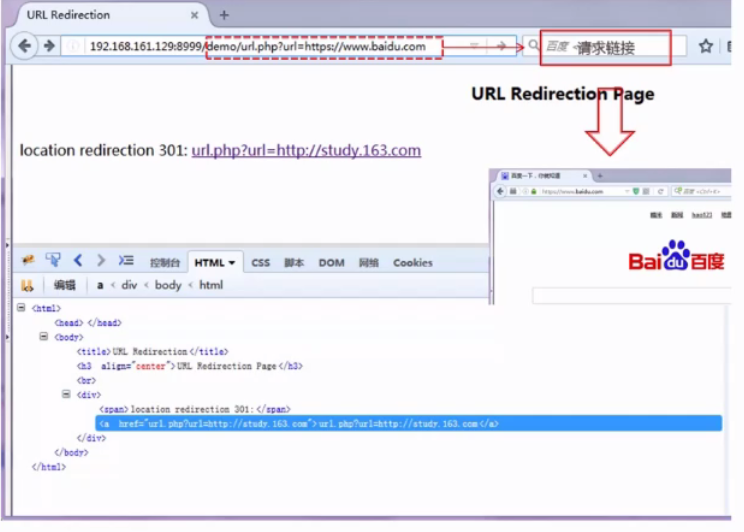
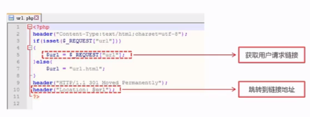
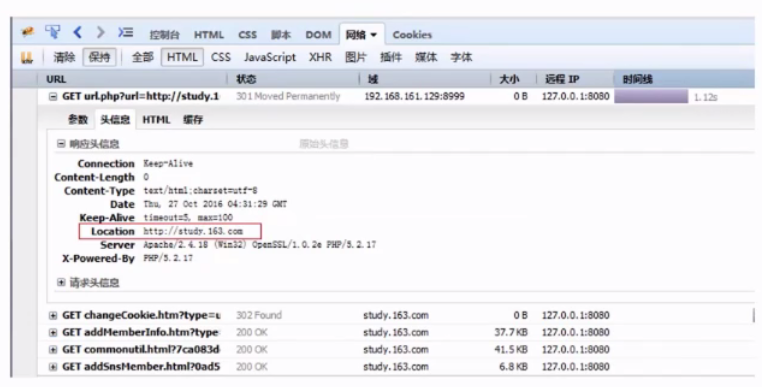
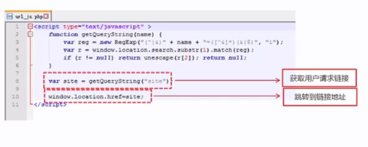
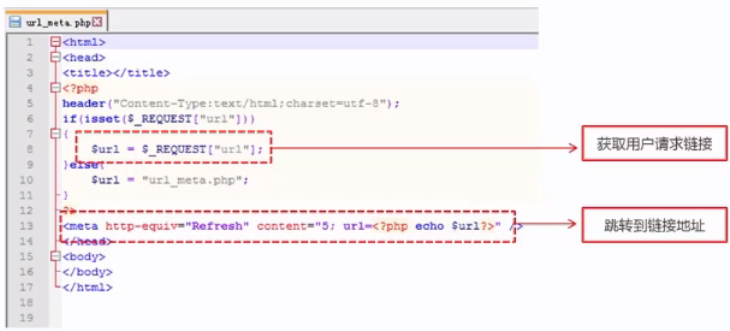
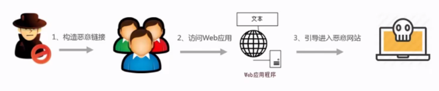
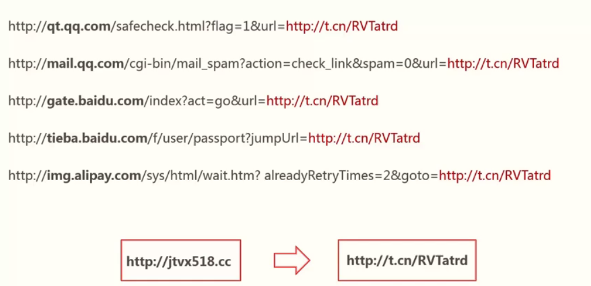

# URL跳转

## URL跳转漏洞

### 定义：

#### 借助未验证的URL跳转，将应用程序引导到不安全的第三方区域，从而导致的安全问题

####直接访问跳转页面

####回车跳转到云客堂

#### 直接访问跳转页面

#### 回车跳转到百度

## 实现方式

### Header头条转

#### 获取链接

#### Header方法页面跳转

### Javascript跳转

#### 获取链接

#### Js页面跳转

### META标签跳转

#### 获取链接

#### META实现跳转

## 原理分析

####攻击实例

#### 回车，跳转恶意网站

## 课程回顾

### URL跳转漏洞是什么

### URL跳转的实现方法

### 漏洞的利用方法