 # xss

##Cross Site Script

####中文名称：跨站脚本攻击

####危害：盗取用户信息、钓鱼、制造蠕虫等

## 危害：

####通过**HTML注入**篡改网页，插入了恶意脚本，当用户在浏览网页时。实现控制用户浏览器行为的一种攻击方式。

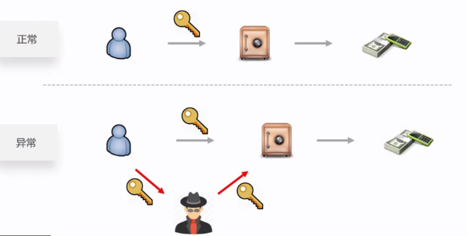

#XSS分类

##存储型

#### 访问网站，触发XSS

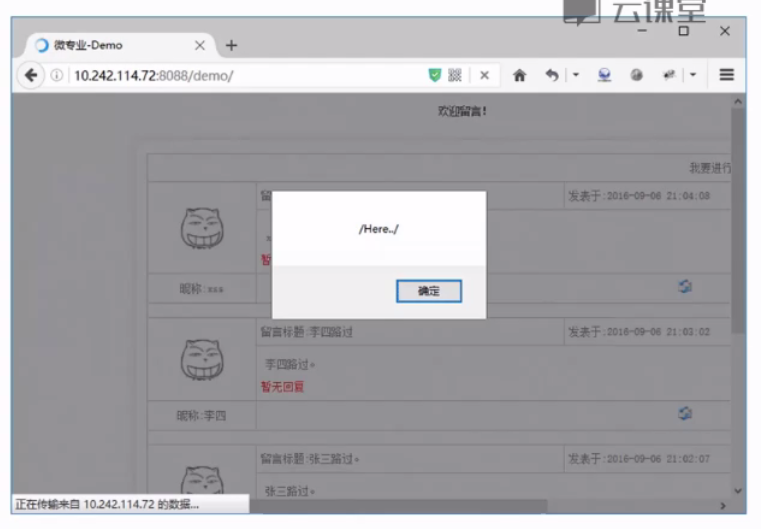

#### 安装Firebug插件

####查看源码，了解详细

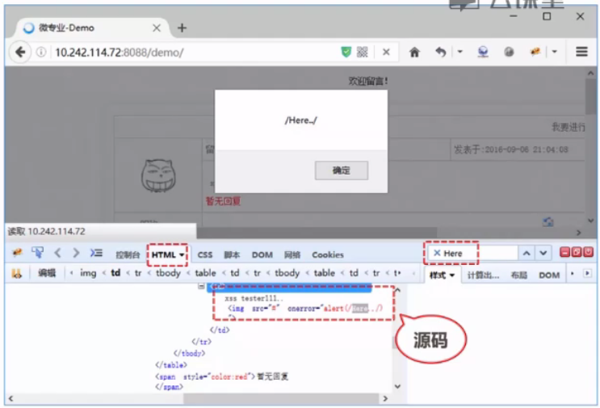

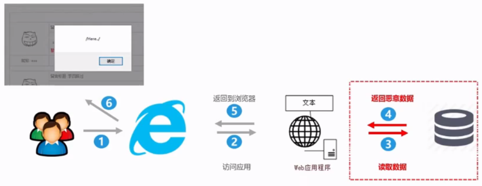

##反射型

#### 访问携带XSS脚本的链接触发XSS

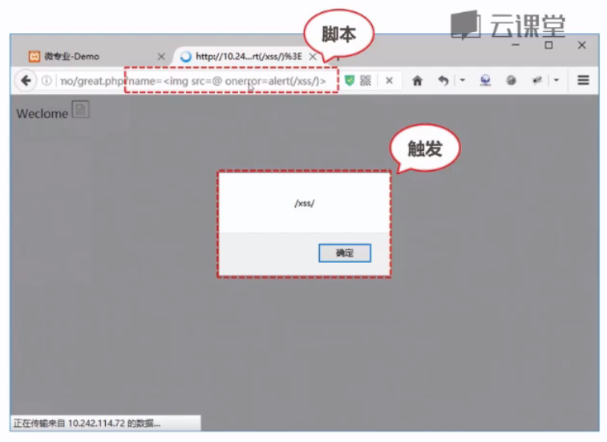

#### 查看源码，了解详细

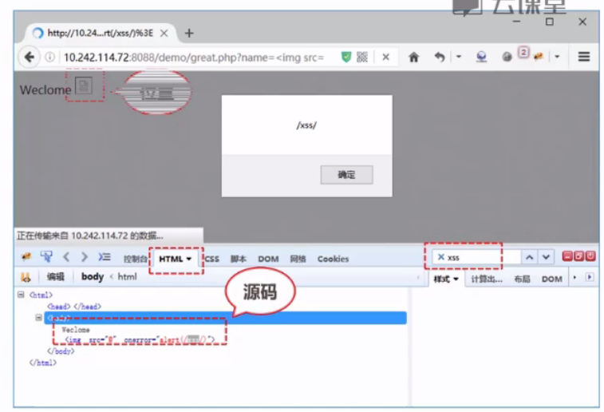

### 原理解析

#### 用户获取参数后，直接输出到客户端，导致XSS

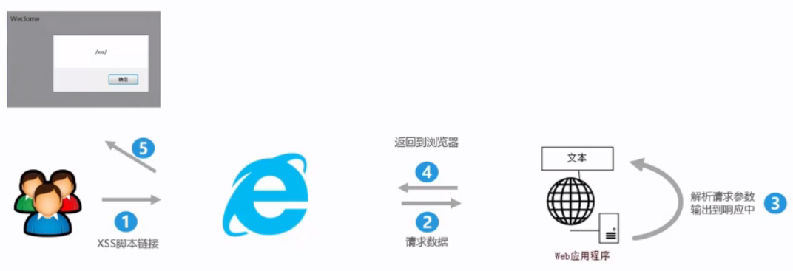

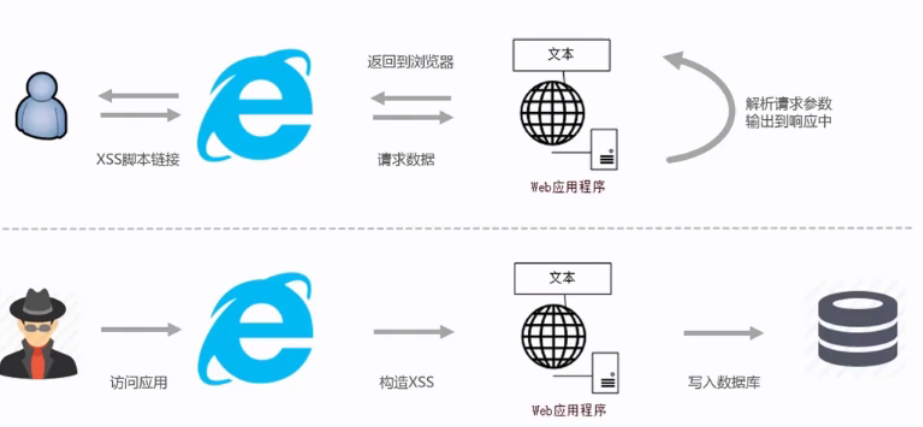

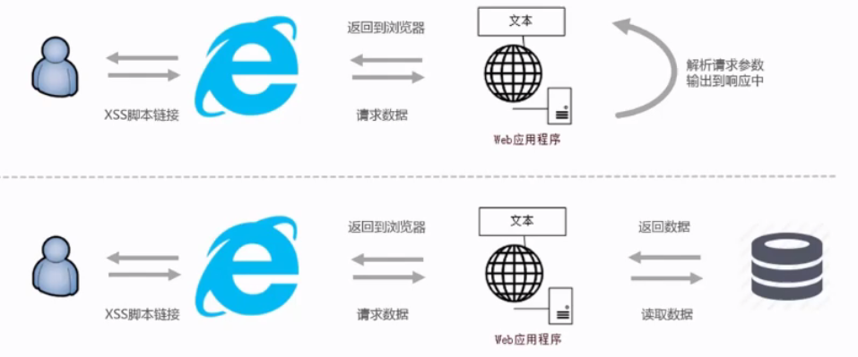

##DOM型

####访问携带XSS脚本的链接触发XSS

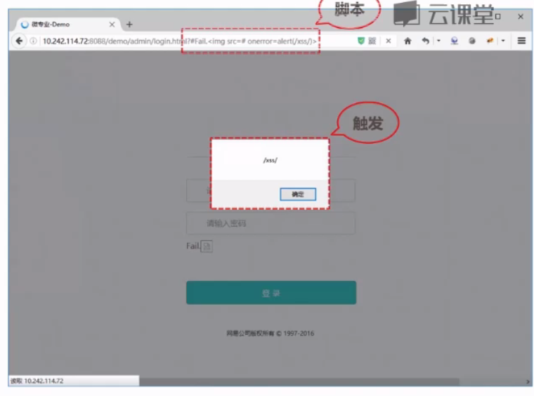

####查看源码，了解详细

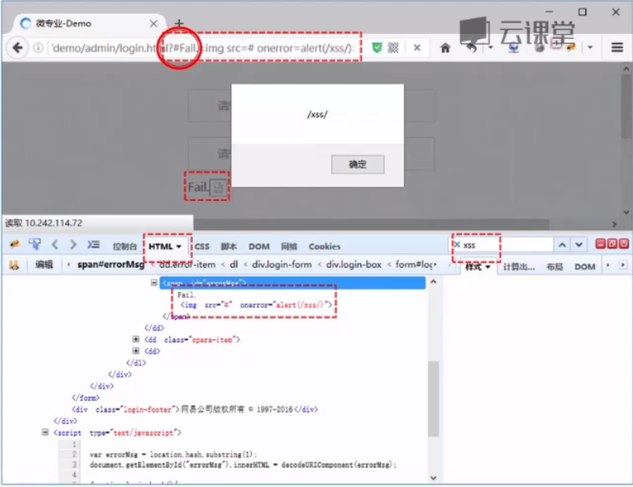

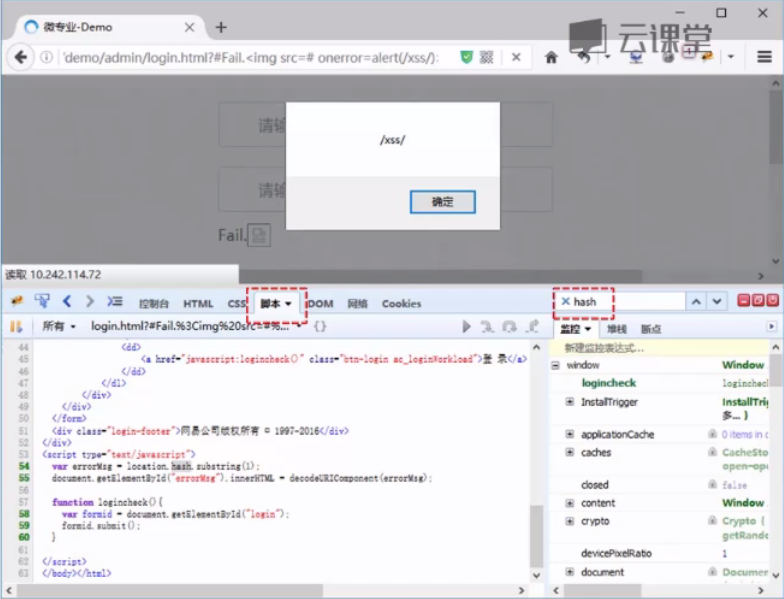

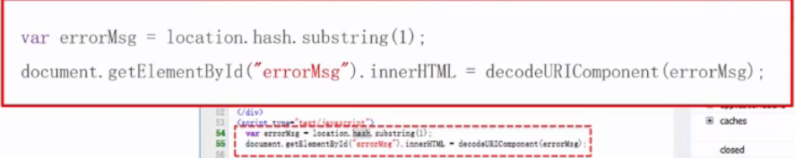

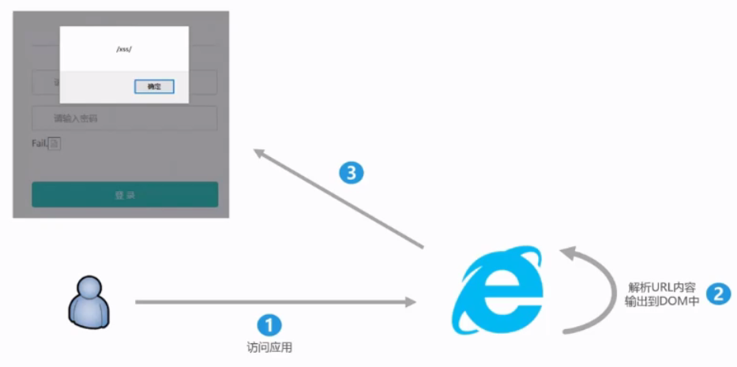

## 课程回顾

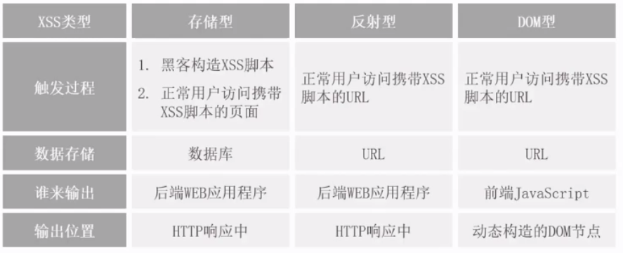