# 点击劫持

###套娃

#### 1.嵌套

#### 2.内部不可见

## iframe

#### 可以创建包含另外一个文档的内联框架

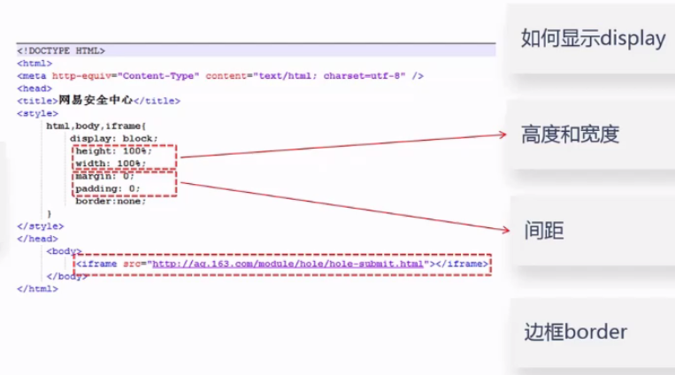

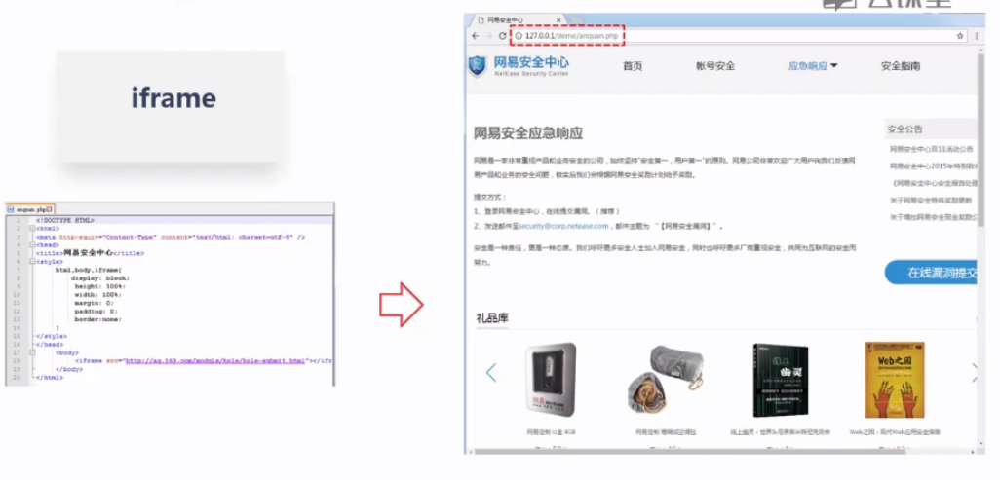

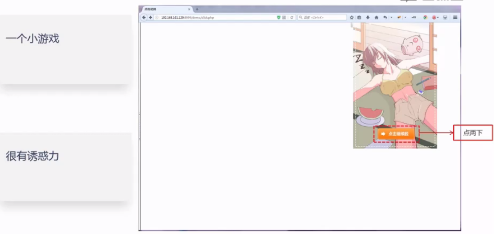

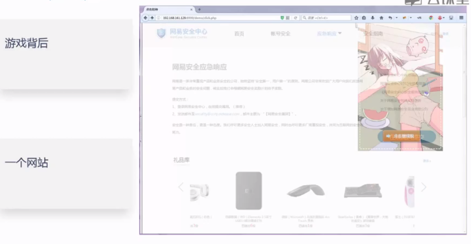

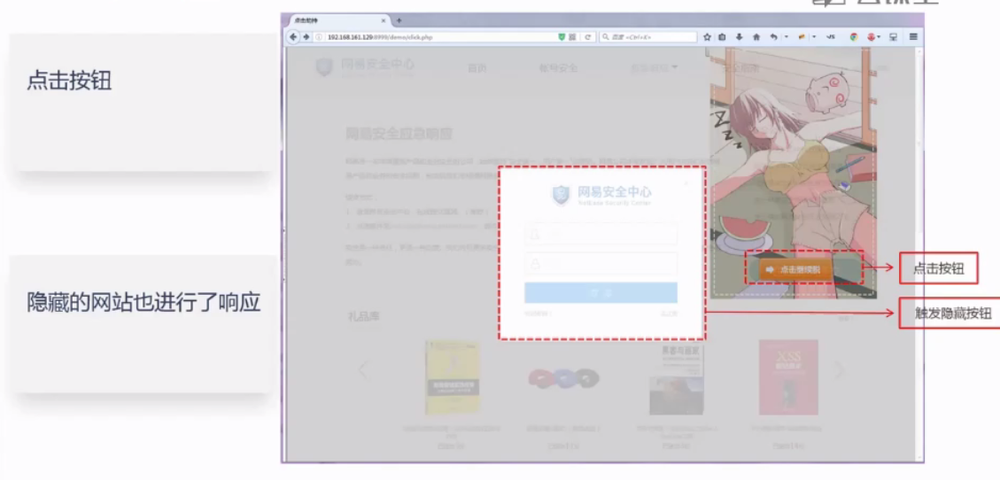

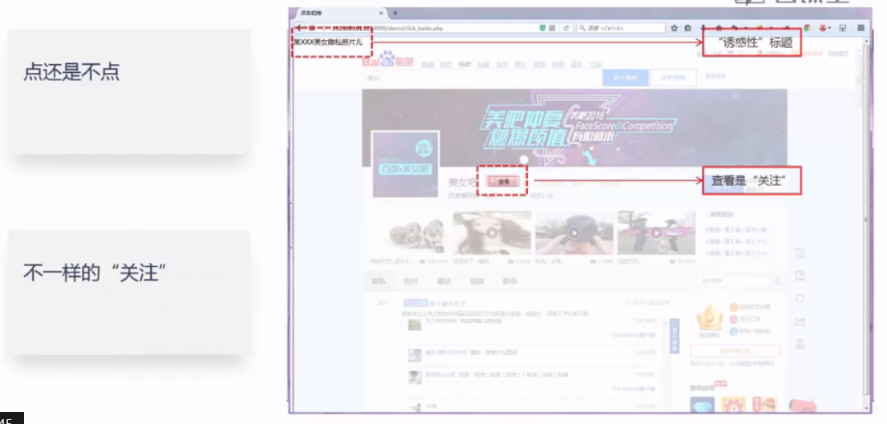

## 点击劫持

### 通过覆盖不可见的框架误导受害者点击而造成的攻击行为

### 隐蔽性较高

骗取用户操作

UI-覆盖攻击

利用Iframe或者其他标签的属性

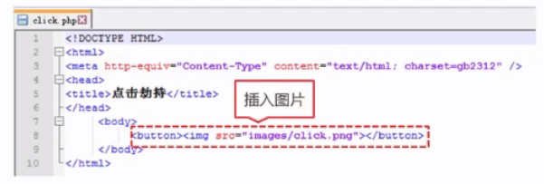

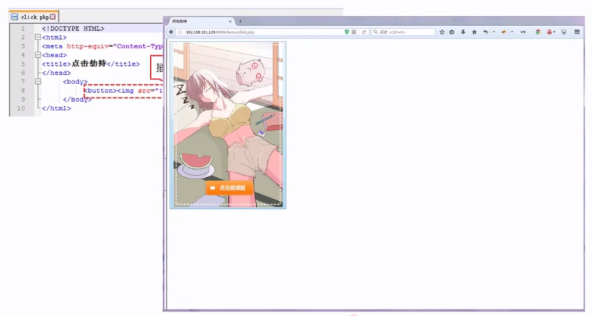

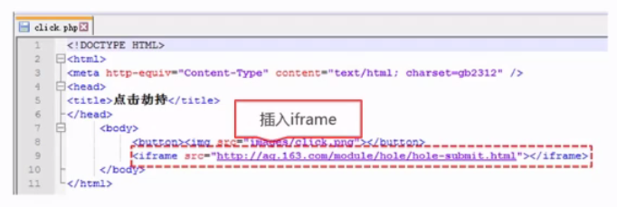

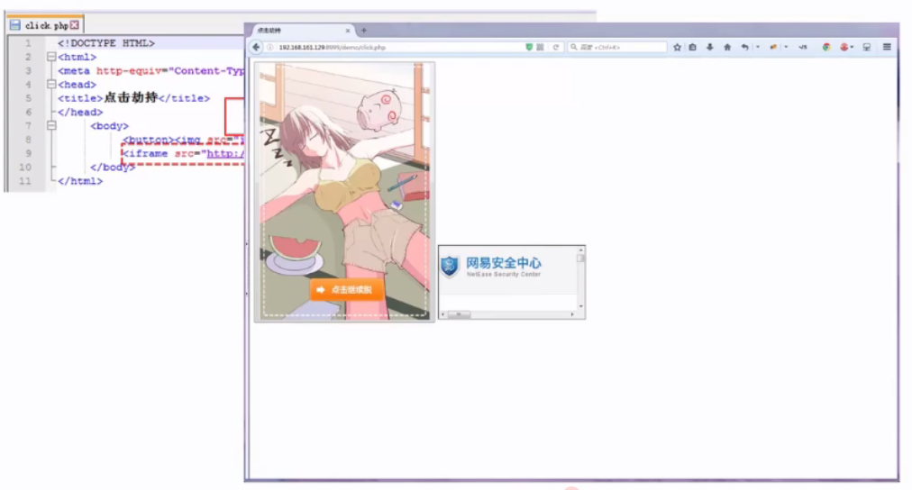

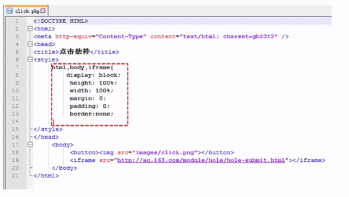

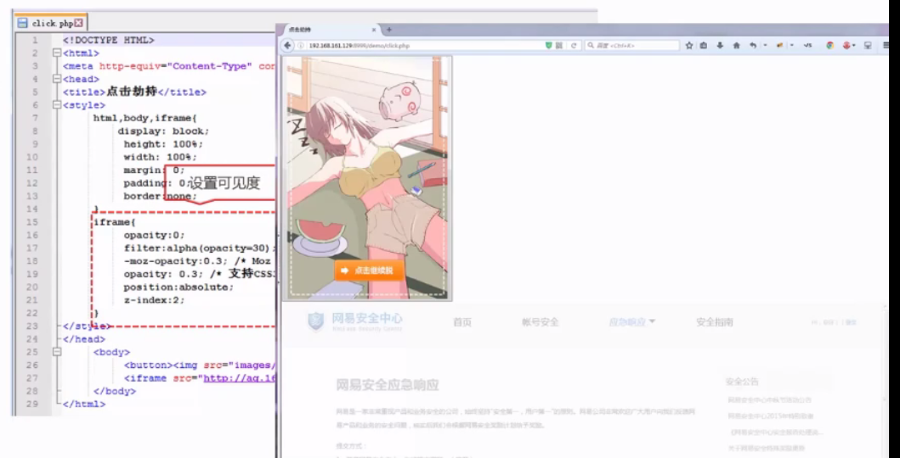

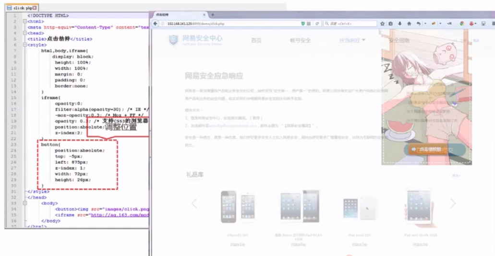

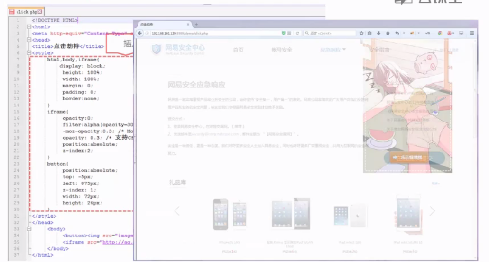

## 课程回顾

### 什么是点击劫持

### 点击劫持的构造

