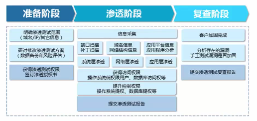

 # 信息收集专题概述

## 专题内容

####1、介绍信息收集相关概念、作用、收集目标

####2、介绍GoogleHacking相关知识、演示搜索语法的使用方法

####3、介绍通过目标网站收集、分析信息，如何利用站长工具收集信息

####4、介绍针对目标系统使用的平台软件进行有针对性的漏洞搜索方法

####5、介绍使用nmap、AWVS等数个扫描工具进行信息收集

####6、介绍在Kali Linux下使用多种工具进行信息收集

####7、介绍伪造身份，在社交网站中挖掘、套取有用的信息

###常见的一些信息收集目标有以下几种：（如果测试合同不予限制）

####1.组织架构，详细的组织结构图、部门架构图、团队结构图

####2.组织的基础设施信息，包括IP地址空间和网络拓扑

####3.使用技术，包括硬件平台和软件的配置状态

####4.员工电子邮件地址、手机号码

####5.组织的合作伙伴

####6.组织设施的物理位置

###信息收集的作用：

####1.减小了渗透测试的范围，加强了渗透的针对性

####2.是得渗透过程简介高效，避免做一些无关的测试

####3.提高渗透效率，拓展渗透思路和方法